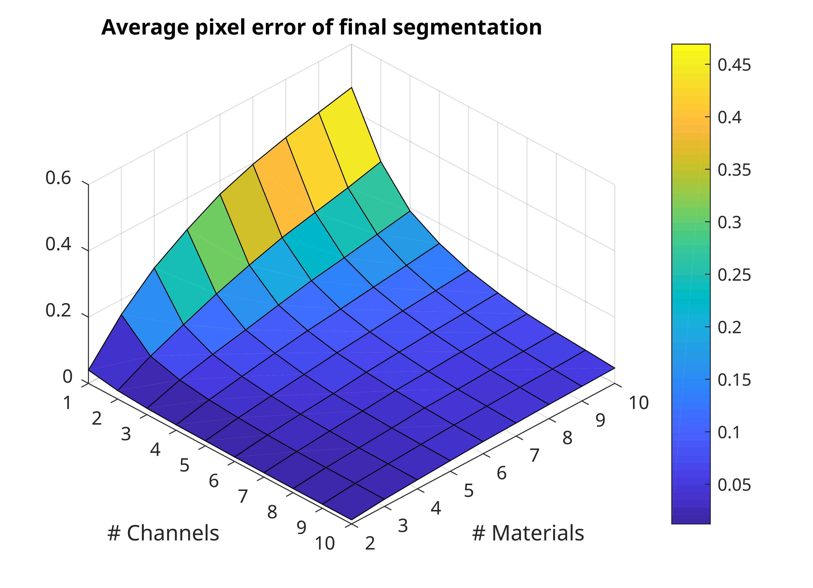
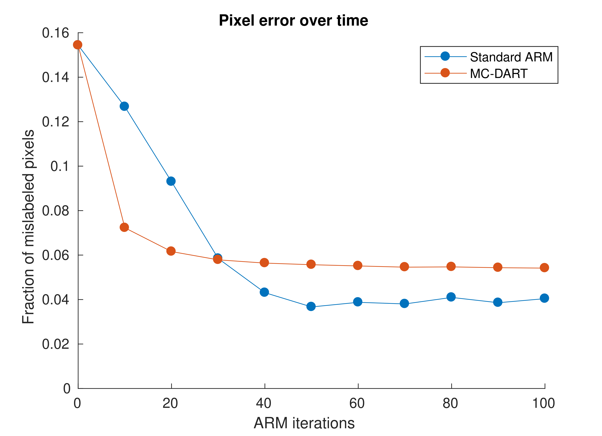

# <a href="https://link.springer.com/chapter/10.1007/978-3-030-05288-1_13" style="color: black;">MC-DART</a>: Multi-channel tomographic reconstruction with Multi-Channel DART

   <p align="center">
   
    </p>
    
## Introduction

...

## Requirements

The code requires Python and MATLAB (r2020 and above recommended) to run. It also requires the following packages:

**Major**:
ASTRA Toolbox:
https://github.com/astra-toolbox/astra-toolbox

Minor (but essential):
numpy, pylab, scipy, tifffile

The code has been tested with Python version 3.6.10 on Fedora 36, with Intel(R) Core(TM) i7-7700K CPU, GeForce GTX 1070 GPU, CUDA version 11.8 and CUDA toolkit 10.1.243.


## Scripts

The package contains code to apply the MC-DART method, as well as scripts to carry out experiments in the associated conference [paper](https://link.springer.com/chapter/10.1007/978-3-030-05288-1_13). The first experiment explores the performance of MC-DART when the number of materials and number of channels are varied. The second experiment investigates the performance (in pixel error per material class over number of iterations) of MC-DART compared to straightforward multi-channel reconstruction. The scripts folder is organized in the following manner:

```
├── scripts
    ├── HelperFunctions.py
    ├── MCDART.py
    ├── MCDARTExp1.py
    ├── MCDARTExp1PostProc.m
    ├── MCDARTExp1Runs.sh
    ├── MCDARTExp2.py
    ├── MCDARTExp2DARTRuns.sh
    ├── MCDARTExp2NoDARTRuns.sh
    ├── MCDARTExp2PostProc.m
    ├── MCDARTHelpFunctions.py
    ├── NonDARTRecs.py
    └── ObjectAssembler.py
```    

To reproduce the results in the [paper](https://link.springer.com/chapter/10.1007/978-3-030-05288-1_13), follow the following scripts:
- **Section 4, Fig. 4 and 5:** Run the MCDARTExp1Runs.sh scripts to generate the results and MCDARTExp1PostProc.m to generate the plots.
- **Section 4, Fig. 6**: Run the MCDARTExp2DARTRuns.sh and MCDARTExp2NoDARTRuns.sh scripts to generate the results and MCDARTExp2PostProc.m to generate the plots.

The resulting plots (see examples below) will be located /results/plots folder. The results may differ slightly since in the original scripts no fixed seeds were used.

## Example results

Below are data samples and the results of the MC-DART experiments:

   <p align="center">
   
   
   </p>
   <p align="center">
   
   
   </p>

...

## References

The algorithms and routines implemented in this package are described in the following [conference paper](https://link.springer.com/chapter/10.1007/978-3-030-05288-1_13) published in the proceedings of the 19th International Workshop on Combinatorial Image Analysis (IWCIA 2018). If you use (parts of) this code in a publication, we would appreciate it if you would refer to:

```
@inproceedings{
  title={A Multi-Channel DART Algorithm},
  author={Zeegers, Math{\'e} and Lucka, Felix and Batenburg, Kees Joost},
  booktitle={Combinatorial Image Analysis: 19th International Workshop, IWCIA 2018, Porto, Portugal, November 22--24, 2018, Proceedings 19},
  pages={164--178},
  year={2018},
  organization={Springer}
}
```

## Authors

Code written by:
- Mathé Zeegers (m [dot] t [dot] zeegers [at] cwi [dot] nl).

Spatial 2D configurations created with help from [Felix Lucka](https://github.com/FelixLucka). 
